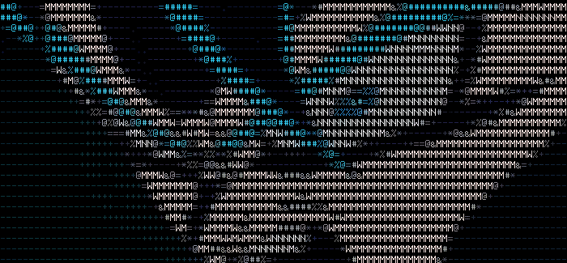
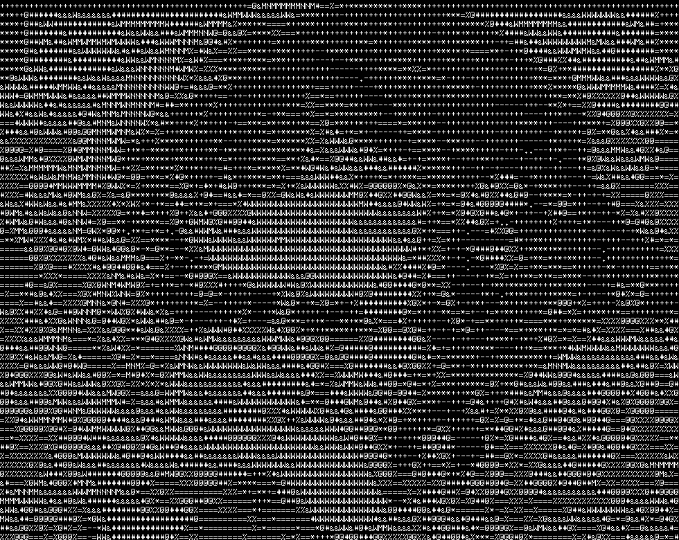
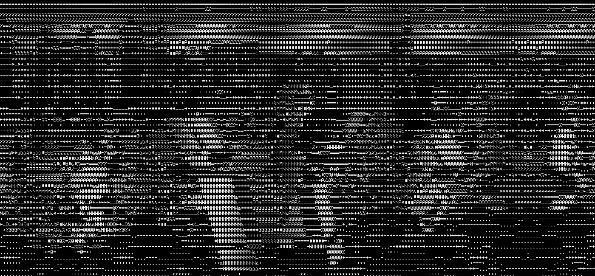
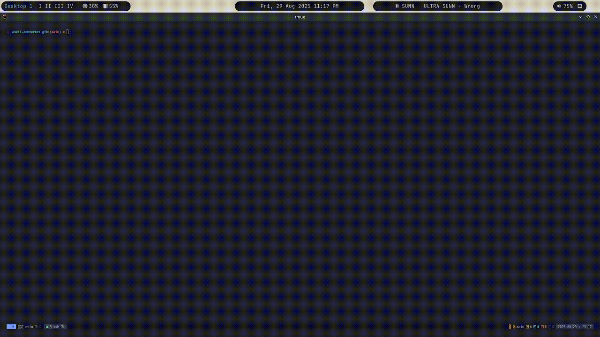

# 🎥 ASCII Converter  
Convert images, GIFs, videos and webcam steam into ASCII art in the terminal or save them as files.

**ASCII Converter** is a tool that can be used to convert or preview images (`png`, `jpg`), GIFs, videos (`mp4`, `avi`, `mov`, `webm`) and webcam streams in ASCII art mode.
> ⚠️ Video and webcam support requires **FFmpeg** to be installed.  
> 📷 Camera conversion is currently available **only on Linux**.
## Installation

```bash
go install github.com/Apollo478/ascii-converter@latest
```
# GIF/Image to ASCII Comparison

Here’s a side-by-side look at the conversion:

| Original | ASCII (no color) | ASCII (colored) |
|--------------|------------------|-----------------|
|  |  |  |
|  |  |  |
|  |  |  |
|  |  |  |


## 📖 Usage

```bash
Usage: ac <command> [options]

Commands:
  convert   Convert image/gif/video to ASCII
  preview   Preview ASCII frames in terminal
  camera    Preview/convert camera ASCII frames

``` 
### convert 
```bash
ac convert -i <input> -o <output> [options]

# Options
Usage of convert:
  -C    Alias for --color
  -I    Alias for --invert
  -P    Alias for --preview
  -a float
        Alias for --aspect-ratio (default 0.5)
  -aspect-ratio float
        Set aspect ratio of ASCII’s Y axis (default 0.5)
  -clear-screen
        Clear screen before printing frames (default true)
  -color
        Enable colored ASCII
  -f    Alias for --fit-terminal
  -fit-terminal
        Fit ASCII to terminal size
  -h int
        Alias for --height (default 120)
  -height int
        ASCII height (default 120)
  -i string
        Alias for --input
  -input string
        Input file
  -invert
        Invert the ASCII scale
  -o string
        Alias for --output
  -output string
        output file
  -p    Alias for --parallel
  -parallel
        Process frames in parallel
  -preview
        Preview ascii while saving
  -s    Alias for --clear-screen (default true)
  -w int
        Alias for --width (default 140)
  -width int
        ASCII width (default 140)
```
### preview 
```bash
ac preview -i <input> [options]

#Options
Usage of preview:
  -C    Alias for --color
  -I    Alias for --invert
  -a float
        Alias for --aspect-ratio (default 0.5)
  -aspect-ratio float
        Set aspect ratio of ASCII’s Y axis (default 0.5)
  -clear-screen
        Clear screen before printing frames (default true)
  -color
        Enable colored ASCII
  -f    Alias for --fit-terminal
  -fit-terminal
        Fit ASCII to terminal size
  -h int
        Alias for --height (default 120)
  -height int
        ASCII height (default 120)
  -i string
        Alias for --input
  -input string
        Input file
  -invert
        Invert the ASCII scale
  -p    Alias for --parallel
  -parallel
        Process frames in parallel
  -s    Alias for --clear-screen (default true)
  -w int
        Alias for --width (default 140)
  -width int
        ASCII width (default 140)
```
### camera 
```bash
ac camera  [options]

# Options
Usage of camera:
  -C    Alias for --color
  -I    Alias for --invert
  -P    Alias for --preview
  -a float
        Alias for --aspect-ratio (default 0.5)
  -aspect-ratio float
        Set aspect ratio of ASCII’s Y axis (default 0.5)
  -clear-screen
        Clear screen before printing frames (default true)
  -color
        Enable colored ASCII
  -f    Alias for --fit-terminal
  -fit-terminal
        Fit ASCII to terminal size
  -h int
        Alias for --height (default 120)
  -height int
        ASCII height (default 120)
  -invert
        Invert the ASCII scale
  -o string
        Alias for --output
  -output string
        output file
  -p    Alias for --parallel
  -parallel
        Process frames in parallel
  -preview
        Preview ascii while saving
  -s    Alias for --clear-screen (default true)
  -w int
        Alias for --width (default 140)
  -width int
        ASCII width (default 140)
```
## 🎥 CLI Demo

Here’s a quick demo of the CLI converting a video into ASCII art:



In this example, the tool takes a video input and outputs an ASCII-rendered version in real time.

### Try it yourself
```bash
ac -i input.mp4 -o output.mp4 -C
```
